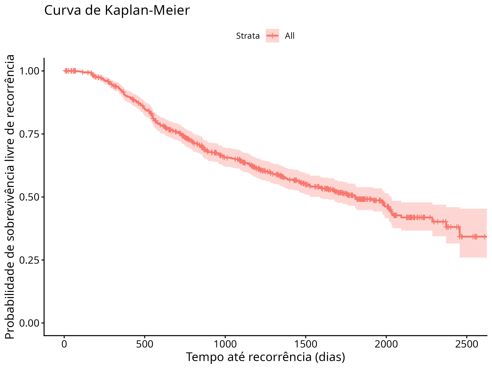
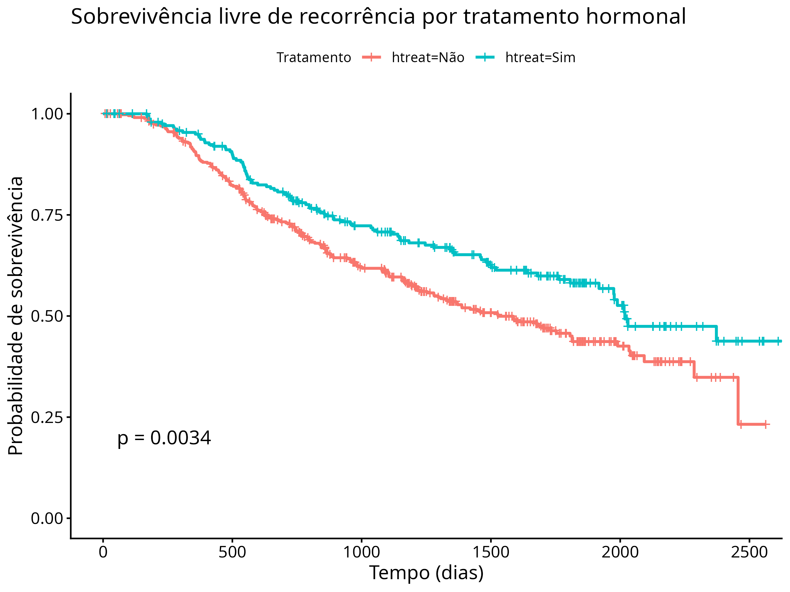
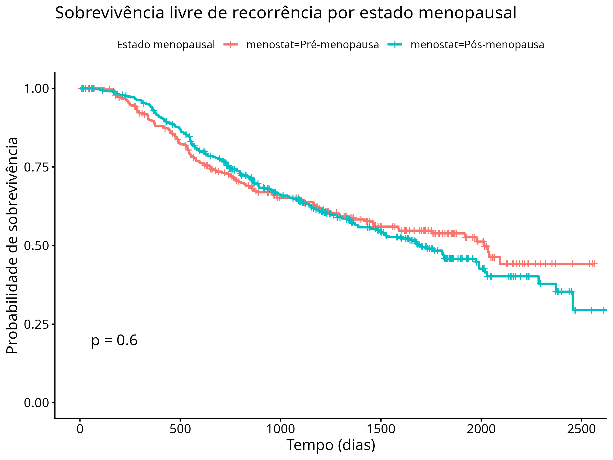
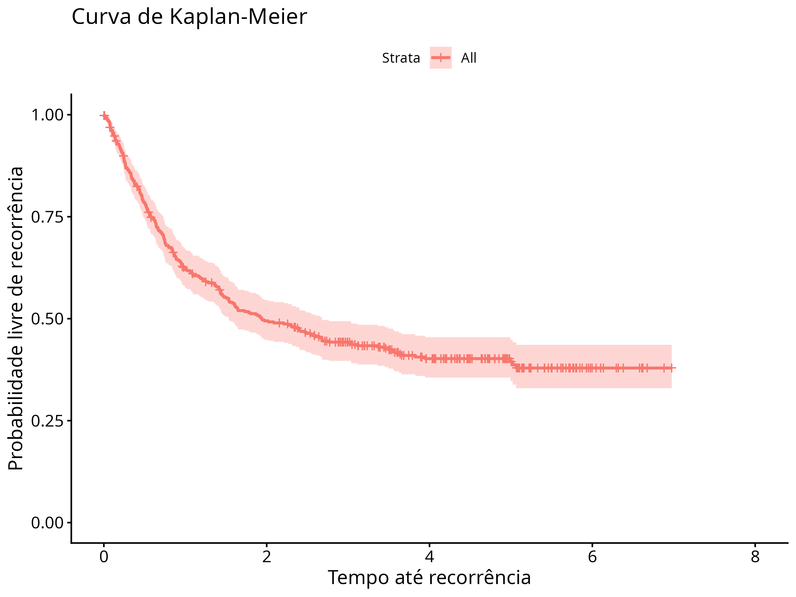
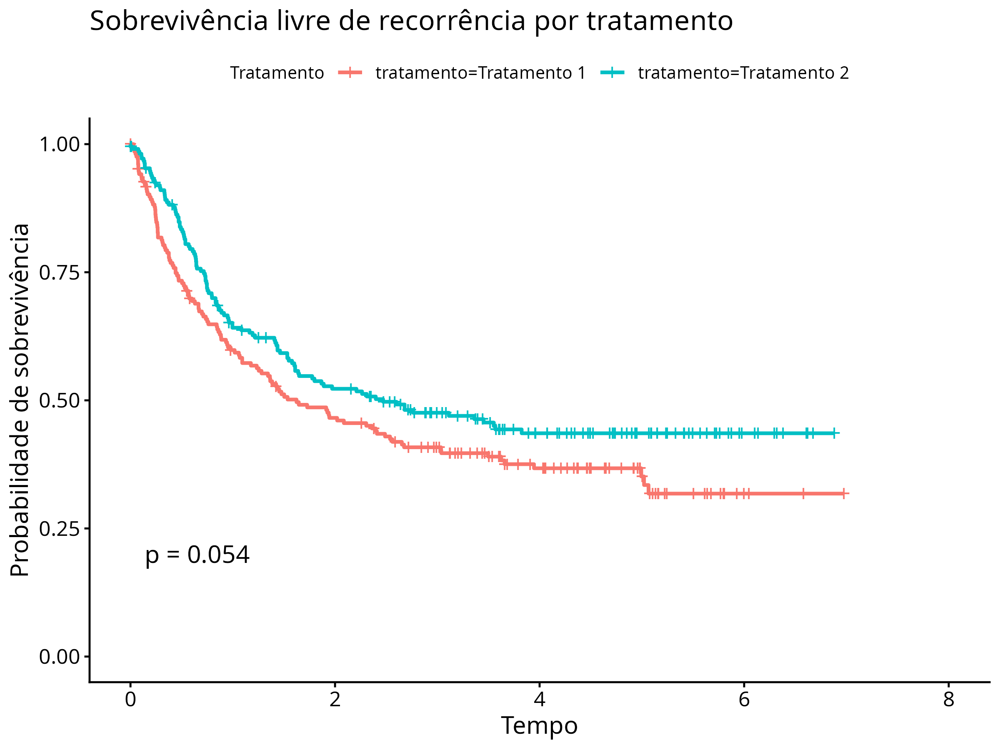
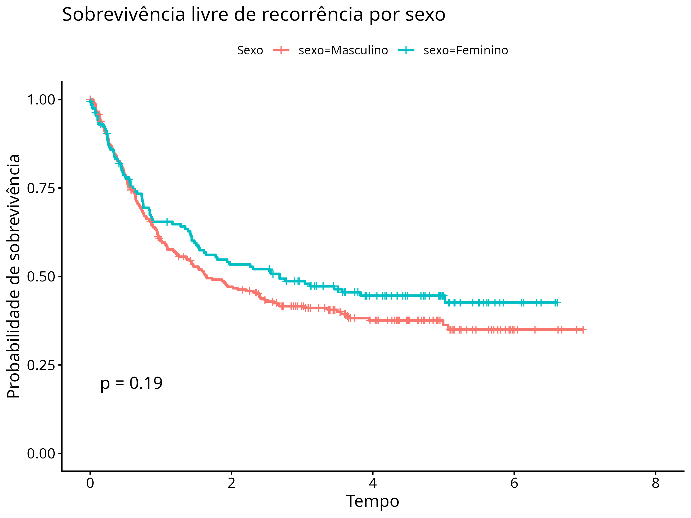
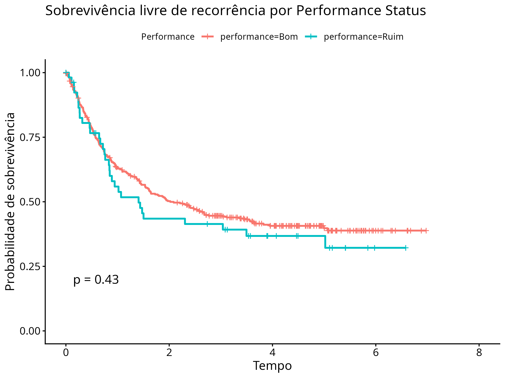
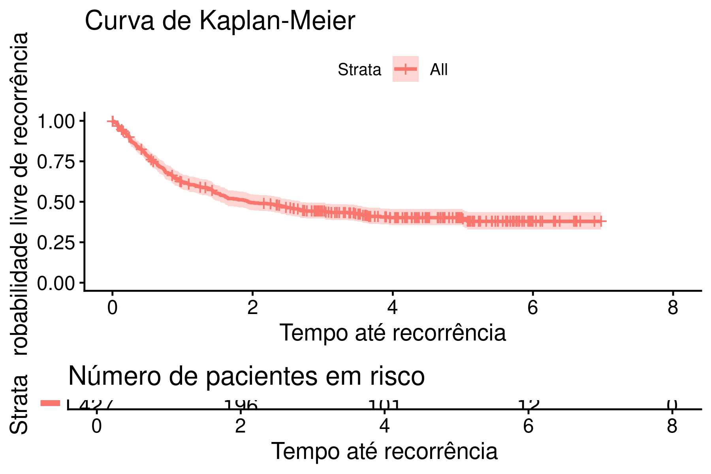

```{r}
#| label: options
#| echo: false
#| warning: false

options(dplyr.summarise.inform = FALSE)

library(dplyr)
library(gtsummary)
library(gt)
library(survstan)
library(tidyverse)
library(shrink)
library(broom)
library(survival)
library(knitr)
library(kableExtra)

data(GBSG)


gbsg <- GBSG %>%
  mutate(
    htreat = factor(htreat,
                    levels = c(0, 1),
                    labels = c("Não", "Sim")),
    
    menostat = factor(menostat,
                      levels = c(1, 2),
                      labels = c("Pré-menopausa",
                                 "Pós-menopausa")),
    
    tumgrad = factor(tumgrad,
                     levels = c(1, 2, 3),
                     labels = c("Grau I",
                                "Grau II",
                                "Grau III")),
    
    status = factor(cens,
                    levels = c(0, 1),
                    labels = c("Censurado", "Evento"))
  ) %>%
  select(
    id,
    htreat,
    age,
    menostat,
    tumsize,
    tumgrad,
    posnodal,
    prm,
    esm,
    rfst,
    cens,
    status
  )

rm(GBSG)


```

# Análise do German Breast Cancer Study Group Dataset (GBSG)

## 1. Introdução

Neste trabalho, o objetivo é descrever a amostra e investigar características associadas à recorrência do câncer de mama, considerando variáveis clínicas e demográficas como idade, tamanho do tumor, número de linfonodos positivos, status hormonal e grau tumoral. Inicialmente, é realizada uma análise descritiva da amostra estratificada pelo status de recorrência, seguida de uma comparação entre grupos (censurados e com evento).

## 2. Descrição da amostra

```{r}
#| label: tab-status
#| tbl-cap: "Tabela descritiva das covariáveis categóricas por status de recorrência"
#| echo: false

tab_status <- gbsg %>%
  select(-id, -cens) %>%
  tbl_summary(
    by = status,
    statistic = list(
      all_continuous() ~ "{mean} ({sd})",
      all_categorical() ~ "{n} ({p}%)"
    ),
    missing = "ifany"
  ) %>%
  add_p() %>%
  bold_labels()

tab_status %>%
  as_gt() %>%
  gt::tab_options(
    table.font.size = "medium",
    heading.title.font.size = px(18),
    heading.subtitle.font.size = px(16)
  )
```

```{r}
#| label: tab-summary-continuas
#| tbl-cap: "Resumo das variáveis contínuas por status de recorrência"
#| echo: false

library(dplyr)
library(gt)

tab_cont <- gbsg %>%
  group_by(status) %>%
  summarise(
    `Idade (média ± DP)` = sprintf("%.1f ± %.1f", mean(age, na.rm = TRUE), sd(age, na.rm = TRUE)),
    
    `Tamanho tumoral (média ± DP)` = sprintf("%.1f ± %.1f", mean(tumsize, na.rm = TRUE), sd(tumsize, na.rm = TRUE)),
    
    `Nódulos positivos (média ± DP)` = sprintf("%.1f ± %.1f", mean(posnodal, na.rm = TRUE), sd(posnodal, na.rm = TRUE)),
    
    `Tempo livre de recorrência (média ± DP)` = sprintf("%.1f ± %.1f", mean(rfst, na.rm = TRUE), sd(rfst, na.rm = TRUE))
  )

tab_cont %>%
  gt() %>%
  tab_header(
    title = "Resumo descritivo das variáveis contínuas",
    subtitle = "Estratificado por status de recorrência"
  ) %>%
  cols_label(
    status = "Status"
  ) %>%
  fmt_number(
    columns = where(is.numeric),
    decimals = 1
  )
```

A amostra é composta por 6.862 pacientes, sendo 3.871 (56,4%) censuradas e 2.991 (43,6%) que apresentaram recorrência da doença.

A Tabela 1 apresenta a distribuição das variáveis categóricas segundo o status de recorrência. Observa-se associação estatisticamente significativa entre o desfecho e as variáveis tratamento hormonal (htreat), grau tumoral (tumgrad), número de linfonodos positivos (posnodal), prm e esm. Em geral, o grupo com evento apresenta maior frequência de características associadas a pior prognóstico, como maior grau tumoral.

Para as variáveis contínuas (Tabela 2), nota-se que idade e status de menopausa são semelhantes entre os grupos. Por outro lado, o grupo com recorrência apresenta maior tamanho tumoral e maior número de linfonodos positivos, além de menor tempo livre de recorrência, como esperado.
## 3. Análise não paramétrica da sobrevivência

### 3.1 Kaplan-Meier global


Observa-se uma redução progressiva da função de sobrevivência ao longo do tempo, indicando ocorrência contínua de eventos durante o acompanhamento. No início do estudo, a probabilidade de permanecer livre de recorrência é elevada, com estimativas próximas de 0,92 no primeiro ano (365 dias). Em 730 dias, essa probabilidade reduz para aproximadamente 0,75, e em 1.095 dias atinge cerca de 0,64, evidenciando queda consistente da sobrevida livre de recorrência ao longo do tempo.

### 3.2 Kaplan-Meier por grupos

#### 3.2.1 Tratamento hormonal



O grupo que recebeu tratamento (htreat = “Sim”) apresenta maior tempo de sobrevivência livre de recorrência quando comparado ao grupo sem tratamento (htreat = “Não”). A mediana de tempo livre de recorrência foi de aproximadamente 1.528 dias (IC95%: 1.296–1.814) no grupo não tratado, enquanto no grupo tratado foi de aproximadamente 2.018 dias (IC95%: 1.918–não estimado), indicando melhor prognóstico neste último grupo.

#### 3.2.2 Estado menopausal


A mediana de tempo livre de recorrência foi de aproximadamente 2.015 dias para pacientes em pré-menopausa (IC95%: 1.587–não estimado) e 1.701 dias para pacientes em pós-menopausa (IC95%: 1.481–1.990), sugerindo pior prognóstico neste último grupo.

Nota-se que as curvas apresentam sobreposição e cruzamento em alguns pontos do seguimento, o que indica ausência de separação consistente entre os grupos ao longo de todo o tempo, além de indicar impossibilidade de modelar o modelo de riscos proporcionais.

#### 3.2.3 Grau tumoral



Pacientes com tumores de grau I apresentam melhor evolução, com mediana de tempo livre de recorrência não atingida com precisão no período observado. Para grau II, a mediana foi de aproximadamente 1.730 dias (IC95%: 1.493–2.030), enquanto para grau III foi de aproximadamente 1.337 dias (IC95%: 960–não estimado), evidenciando redução progressiva do tempo livre de recorrência com o aumento da agressividade tumoral.

As probabilidades de sobrevivência em tempos fixos reforçam esse padrão. Em 365 dias, as estimativas são de 1,00 para grau I, 0,92 para grau II e 0,85 para grau III. Em 730 dias, essas probabilidades caem para 0,93, 0,76 e 0,63, respectivamente. Já em 1.095 dias, observa-se redução ainda mais acentuada, com sobrevivência de 0,84 (grau I), 0,64 (grau II) e 0,55 (grau III).

## 4. Testes de comparação entre grupos

### 4.1 Testes com ρ diferentes

```{r}
#| label: tabela-logrank
#| echo: false
#| message: false

# htreat ------------------------------------------------------------

teste_htreat_0  <- survdiff(Surv(rfst, cens) ~ htreat, data = gbsg, rho = 0)
teste_htreat_05 <- survdiff(Surv(rfst, cens) ~ htreat, data = gbsg, rho = 0.5)
teste_htreat_1  <- survdiff(Surv(rfst, cens) ~ htreat, data = gbsg, rho = 1)
teste_htreat_m1 <- survdiff(Surv(rfst, cens) ~ htreat, data = gbsg, rho = -1)

# menostat ----------------------------------------------------------

teste_meno_0  <- survdiff(Surv(rfst, cens) ~ menostat, data = gbsg, rho = 0)
teste_meno_05 <- survdiff(Surv(rfst, cens) ~ menostat, data = gbsg, rho = 0.5)
teste_meno_1  <- survdiff(Surv(rfst, cens) ~ menostat, data = gbsg, rho = 1)
teste_meno_m1 <- survdiff(Surv(rfst, cens) ~ menostat, data = gbsg, rho = -1)

# tumgrad -----------------------------------------------------------

teste_grad_0  <- survdiff(Surv(rfst, cens) ~ tumgrad, data = gbsg, rho = 0)
teste_grad_05 <- survdiff(Surv(rfst, cens) ~ tumgrad, data = gbsg, rho = 0.5)
teste_grad_1  <- survdiff(Surv(rfst, cens) ~ tumgrad, data = gbsg, rho = 1)
teste_grad_m1 <- survdiff(Surv(rfst, cens) ~ tumgrad, data = gbsg, rho = -1)

# tabela resumo -----------------------------------------------------

resultado <- tibble(
  variavel = c(
    rep("htreat", 4),
    rep("menostat", 4),
    rep("tumgrad", 4)
  ),
  rho = rep(c(0, 0.5, 1, -1), 3),
  chisq = c(
    teste_htreat_0$chisq,
    teste_htreat_05$chisq,
    teste_htreat_1$chisq,
    teste_htreat_m1$chisq,
    
    teste_meno_0$chisq,
    teste_meno_05$chisq,
    teste_meno_1$chisq,
    teste_meno_m1$chisq,
    
    teste_grad_0$chisq,
    teste_grad_05$chisq,
    teste_grad_1$chisq,
    teste_grad_m1$chisq
  ),
  gl = c(
    rep(length(teste_htreat_0$n) - 1, 4),
    rep(length(teste_meno_0$n) - 1, 4),
    rep(length(teste_grad_0$n) - 1, 4)
  )
) %>%
  mutate(
    pvalor = pchisq(chisq, df = gl, lower.tail = FALSE)
  )

resultado_tab <- resultado %>%
  mutate(
    rho = factor(rho, levels = c(0, 0.5, 1, -1),
                 labels = c("Log-rank (ρ = 0)",
                            "Tarone-Ware (ρ = 0.5)",
                            "Wilcoxon (ρ = 1)",
                            "Fleming-Harrington (ρ = -1)")),
    pvalor = format.pval(pvalor, digits = 3, eps = 0.001)
  )

resultado_tab %>%
  gt() %>%
  tab_header(
    title = "Testes de comparação de curvas de sobrevivência",
    subtitle = "Resultados por variável e pesos (ρ)"
  ) %>%
  cols_label(
    variavel = "Variável",
    rho = "Teste",
    chisq = "Qui-quadrado",
    gl = "Graus de liberdade",
    pvalor = "p-valor"
  ) %>%
  fmt_number(
    columns = chisq,
    decimals = 3
  ) %>%
  tab_style(
    style = cell_text(weight = "bold"),
    locations = cells_column_labels()
  )
```

Para a variável tratamento hormonal (htreat), observam-se diferenças estatisticamente significativas entre as curvas em todos os testes avaliados. O teste log-rank padrão (ρ = 0) indicou diferença significativa entre os grupos (χ² = 8,565; p = 0,0034), resultado consistente com os testes ponderados de Tarone-Ware, Wilcoxon e Fleming-Harrington. Isso sugere que o tratamento hormonal está associado ao tempo livre de recorrência, com efeito relativamente robusto ao longo do tempo.

Para o status de menopausa (menostat), não foram observadas diferenças estatisticamente significativas entre as curvas em nenhum dos testes aplicados (p > 0,05), indicando ausência de evidência de associação entre menopausa e tempo de recorrência na amostra analisada.

Já para o grau tumoral (tumgrad), foram observadas diferenças altamente significativas entre as curvas em todos os testes (p < 0,001), independentemente do peso utilizado.

### 4.2 Teste de tendência (variável ordinal)

```{r}
#| label: teste-tendencia
#| echo: false
#| message: false

logrank <- survdiff(
  Surv(rfst, cens) ~ tumgrad,
  data = gbsg
)

u <- with(logrank, obs - exp)
V <- logrank$var

a <- c(1, 2, 3)

c_stat <- crossprod(a, u)
C_stat <- as.numeric(t(a) %*% V %*% a)

z <- c_stat / sqrt(C_stat)

p_value <- 2 * pnorm(abs(z), lower.tail = FALSE)

tab_tendencia <- data.frame(
  Estatistica_Z = as.numeric(z),
  p_valor = p_value
)

tab_tendencia %>%
  gt() %>%
  tab_header(
    title = "Teste de tendência para grau tumoral",
    subtitle = "Avaliação de associação ordinal com log-rank ponderado"
  ) %>%
  fmt_number(
    columns = everything(),
    decimals = 4
  ) %>%
  cols_label(
    Estatistica_Z = "Estatística Z",
    p_valor = "p-valor"
  ) %>%
  tab_style(
    style = cell_text(weight = "bold"),
    locations = cells_column_labels()
  )

```
Considerando o caráter ordinal do grau tumoral, foi aplicado um teste de tendência baseado em log-rank ponderado, o qual também indicou associação significativa entre o aumento do grau tumoral e a redução do tempo livre de recorrência (Z = 4,4678; p < 0,001).

## 5. Investigação de covariáveis contínuas

```{r}
#| label: tabela-cox-univariado
#| echo: false
#| message: false

vars_cont <- c("age", "tumsize", "posnodal", "prm", "esm")

cox_uni <- lapply(vars_cont, function(v) {
  
  f <- as.formula(paste0("Surv(rfst, cens) ~ ", v))
  
  fit <- coxph(f, data = gbsg)
  
  broom::tidy(fit, exponentiate = TRUE, conf.int = TRUE) %>%
    mutate(variavel = v)
})

cox_uni_tab <- bind_rows(cox_uni) %>%
  select(variavel, estimate, conf.low, conf.high, p.value)

# tabela bonita em GT
cox_uni_tab %>%
  gt() %>%
  tab_header(
    title = "Modelos de Cox univariados",
    subtitle = "Hazard Ratios (HR) com IC95%"
  ) %>%
  fmt_number(
    columns = c(estimate, conf.low, conf.high),
    decimals = 3
  ) %>%
  fmt_number(
    columns = p.value,
    decimals = 4
  ) %>%
  cols_label(
    variavel = "Variável",
    estimate = "HR",
    conf.low = "IC 95% (inf)",
    conf.high = "IC 95% (sup)",
    p.value = "p-valor"
  )

```

Foram ajustados modelos de regressão de Cox univariados para investigar a associação entre variáveis contínuas e o risco de recorrência.

A idade não apresentou associação estatisticamente significativa com o desfecho (HR = 0,996; IC95%: 0,984–1,007; p = 0,446), indicando ausência de efeito relevante no risco de recorrência.

O tamanho tumoral mostrou associação significativa com o evento (HR = 1,015; IC95%: 1,008–1,022; p < 0,001), sugerindo que o aumento dessa variável está relacionado a maior risco de recorrência. De forma semelhante, o número de linfonodos positivos também apresentou forte associação com o desfecho (HR = 1,060; IC95%: 1,046–1,074; p < 0,001), indicando aumento substancial do risco conforme há maior comprometimento linfonodal.

As variáveis prm (HR = 0,997; IC95%: 0,996–0,998; p < 0,001) e esm (HR = 0,999; IC95%: 0,998–1,000; p = 0,041) também foram estatisticamente significativas, porém com efeitos de pequena magnitude, sugerindo associações mais discretas com o risco de recorrência.


## 6. Avaliação da hipótese de riscos proporcionais

```{r}
#| label: teste-ph-tabela
#| echo: false
#| message: false

cox0 <- coxph(
  Surv(rfst, cens) ~
    htreat + age + menostat + tumsize +
    tumgrad + posnodal + prm + esm,
  data = gbsg
)

teste_ph <- cox.zph(cox0)

tab_ph <- as.data.frame(teste_ph$table) %>%
  tibble::rownames_to_column("Variável")

# remove colunas que não existem (NUNCA quebra)
cols_exist <- intersect(
  c("chisq", "rho"),
  names(tab_ph)
)

tab_ph %>%
  gt() %>%
  tab_header(
    title = "Teste de riscos proporcionais (Schoenfeld)",
    subtitle = "Modelo de Cox - GBSG"
  ) %>%
  fmt_number(
    columns = any_of(cols_exist),
    decimals = 3
  ) %>%
  fmt_number(
    columns = any_of("p"),
    decimals = 4
  ) %>%
  cols_label(
    Variável = "Variável",
    chisq = "Qui-quadrado",
    p = "p-valor"
  )
```

Como inferido pelos resultados dos gráficos de Kaplan Meyer, há fortes indicativos para não considerar a hipótese de riscos proporcionais. Foram observadas evidências de não proporcionalidade para idade (p = 0,0012), status de menopausa (p = 0,0201), grau tumoral (p = 0,0047), prm (p = 0,0362) e esm (p = 0,0152). Em contrapartida, as variáveis htreat, tumsize e posnodal não apresentaram violação significativa da suposição de riscos proporcionais.

O teste global também foi significativo (p = 0,0037), sugerindo que, no conjunto, o modelo apresenta indícios de violação da suposição de riscos proporcionais.


## 7. Ajustando o modelo

### 7.1 Yang & Prentice e Proporcional Odds

```{r}
#| label: yp-po-ajuste
#| echo: false
#| message: false
#| warning: false

m <- ceiling(sqrt(nrow(gbsg)))

form <- Surv(rfst, cens) ~ htreat + age + menostat +
  tumsize + tumgrad + posnodal + prm + esm

yp <- ypreg(form, data = gbsg)
po <- poreg(form, data = gbsg)

comp_yp_po <- data.frame(
  Modelo = c("PO", "YP"),
  AIC = c(AIC(po), AIC(yp)),
  logLik = c(as.numeric(logLik(po)), as.numeric(logLik(yp)))
)

comp_yp_po %>%
  mutate(DeltaAIC = AIC - min(AIC)) %>%
  gt() %>%
  tab_header(
    title = "Comparação PO vs Yang & Prentice",
    subtitle = "Critérios de ajuste (AIC e log-verossimilhança)"
  ) %>%
  fmt_number(columns = c(AIC, logLik, DeltaAIC), decimals = 3)
```

Diante da evidência de violação da suposição de riscos proporcionais no modelo de Cox, foram ajustados modelos alternativos com relaxamento dessa hipótese: o modelo de Odds Proporcionais (PO) e o modelo de Yang & Prentice (YP). Observa-se que o modelo Yang & Prentice apresentou melhor ajuste aos dados, com menor AIC (5.142,458) em comparação ao modelo de Odds Proporcionais (5.161,377), além de maior log-verossimilhança (−2.551,229 vs −2.569,688).

### 7.3 Diagnóstico dos resíduos

```{r}
#| label: resid-yp
#| fig.width: 6
#| fig.height: 4
#| echo: false

ggresiduals(yp)
```

```{r}
#| label: resid-po
#| fig.width: 6
#| fig.height: 4
#| echo: false

ggresiduals(po)

```

Os gráficos de resíduos de Cox-Snell indicam maior proximidade da linha de referência no modelo YP, sugerindo melhor ajuste global.

## 8. Seleção de modelos e comparação de distribuições

Foram ajustados modelos de Yang & Prentice considerando diferentes especificações para a distribuição da função de risco de baseline, incluindo as distribuições Weibull, Exponencial, Lognormal, Loglogistic e Fatigue.

### 8.1 Definindo a distribuição da Baseline

```{r}
#| label: yp-baselines
#| echo: false

yp_weib <- ypreg(form, data = gbsg, baseline = "weibull")
yp_exp  <- ypreg(form, data = gbsg, baseline = "exponential")
yp_logn <- ypreg(form, data = gbsg, baseline = "lognormal")
yp_llog <- ypreg(form, data = gbsg, baseline = "loglogistic")
yp_fat  <- ypreg(form, data = gbsg, baseline = "fatigue")
```

### 8.2 Critérios AIC e log-verossimilhança

```{r}
#| label: tabela-baselines
#| echo: false

comparacao <- data.frame(
  Modelo = c("Weibull", "Exponential", "Lognormal", "Loglogistic", "Fatigue"),
  logLik = c(
    as.numeric(logLik(yp_weib)),
    as.numeric(logLik(yp_exp)),
    as.numeric(logLik(yp_logn)),
    as.numeric(logLik(yp_llog)),
    as.numeric(logLik(yp_fat))
  ),
  AIC = c(
    AIC(yp_weib),
    AIC(yp_exp),
    AIC(yp_logn),
    AIC(yp_llog),
    AIC(yp_fat)
  )
) %>%
  mutate(DeltaAIC = AIC - min(AIC))

comparacao %>%
  gt() %>%
  tab_header(
    title = "Comparação de distribuições baseline (YP)",
    subtitle = "Seleção via AIC"
  ) %>%
  fmt_number(columns = c(AIC, logLik, DeltaAIC), decimals = 3)

```

Observa-se que o modelo com distribuição Fatigue apresentou o melhor ajuste, com menor AIC (5.138,802), sendo tomado como referência para comparação. O modelo Lognormal apresentou desempenho muito próximo (ΔAIC = 2,101), seguido do Weibull (ΔAIC = 3,656), indicando que essas distribuições também são competitivas.

## 9. Diagnóstico do modelo final

### 9.1 Resíduos de Cox-Snell

```{r}
#| label: coxsnell
#| echo: false
#| fig.width: 6
#| fig.height: 5
#| message: false
#| warning: false

ggresiduals(yp_fat, type = "coxsnell")

```

### 9.2 Resíduos de martingale

```{r}
#| label: martingale-fatigue
#| echo: false
#| fig.width: 6
#| fig.height: 5
#| message: false
#| warning: false

ggresiduals(yp_fat, type = "martingale")

```

De forma geral, para as variáveis categóricas (htreat, menostat e tumgrad), observa-se que os resíduos estão centrados em torno de zero, sem padrões sistemáticos evidentes entre as categorias, o que sugere adequação da forma funcional dessas variáveis no modelo. De maneira geral, os gráficos sugerem que algumas covariáveis contínuas, especialmente idade e tamanho tumoral, podem apresentar relação não estritamente linear com o log risco. Neste estudo, foram ajustados modelos incluindo splines nas variáveis categóricas com o objetivo de avaliar possíveis efeitos não lineares. Entretanto, a comparação entre as especificações indicou que o modelo mais parcimonioso, sem a inclusão de splines, apresentou desempenho equivalente ou superior. Assim, optou-se pela apresentação apenas do modelo final, sendo os resultados das especificações com splines omitidos para manter a breviedade do relatório.

### 9.3 Resíduos de deviance

```{r}
#| label: deviance-fatigue
#| echo: false
#| fig.width: 6
#| fig.height: 5
#| message: false
#| warning: false

ggresiduals(yp_fat, type = "deviance")

```

A maioria dos resíduos está distribuída de forma aproximadamente simétrica em torno de zero, sem padrões sistemáticos evidentes, o que indica um ajuste global razoável do modelo aos dados. Entretanto, há presença de alguns pontos extremos (valores acima de 3 e próximos de 4), sugerindo possíveis observações influentes

## 10. Conclusão

A análise do conjunto de dados GBSG mostrou que variáveis relacionadas à agressividade tumoral, como tamanho do tumor, número de linfonodos positivos e grau histológico, estão associadas ao aumento do risco de recorrência do câncer de mama.

As curvas de Kaplan-Meier e os testes de comparação indicaram diferenças importantes entre grupos, especialmente para grau tumoral e tratamento hormonal, enquanto o status menopausal não apresentou associação significativa.

Nos modelos de regressão de Cox, as principais associações foram observadas para tamanho tumoral e número de linfonodos positivos. A suposição de riscos proporcionais foi violada para algumas covariáveis, o que motivou o uso de modelos mais flexíveis.

Entre os modelos avaliados, o de Yang & Prentice apresentou melhor ajuste, com o modelo final indicando desempenho adequado pelos diagnósticos de resíduos.

# Análise do dataset e1690 (Estudo de Recorrência)

```{r}
#| label: dataset-e1690
#| echo: false
#| message: false
#| warning: false

library(dplyr)
library(gtsummary)
library(survival)
library(survminer)
library(ggplot2)
library(tibble)
library(survcure)

data(e1690)


data <- e1690 %>%
  mutate(
    # Tratamento
    tratamento = factor(trt,
                        levels = c(1, 2),
                        labels = c("Tratamento 1", "Tratamento 2")),
    
    # EVENTO PRINCIPAL: reincidência
    reincidencia = factor(failcens,
                          levels = c(0, 1),
                          labels = c("Censurado", "Reincidência")),
    
    # (opcional) sobrevida geral - não é o foco agora
    status_sobrevida = factor(survcens,
                              levels = c(0, 1),
                              labels = c("Censurado", "Evento")),
    
    sexo = factor(sex,
                  levels = c(1, 2),
                  labels = c("Masculino", "Feminino")),
    
    performance = factor(ps,
                         levels = c(0, 1),
                         labels = c("Bom", "Ruim")),
    
    idade = age,
    nodos = node,
    breslow = as.numeric(breslow)
  ) %>%
  select(
    tratamento,
    tempo_reincidencia = failtime,
    reincidencia,
    idade,
    nodos,
    sexo,
    performance,
    breslow
  )

rm(e1690)

```

## 1. Introdução
Este estudo utiliza o conjunto de dados e1690, proveniente de um estudo clínico voltado ao acompanhamento de pacientes após tratamento oncológico, com o objetivo de investigar a ocorrência de recorrência da doença ao longo do tempo. O banco de dados reúne informações clínicas e demográficas dos pacientes, incluindo variáveis relacionadas ao tipo de tratamento recebido, idade, sexo, número de linfonodos acometidos e indicadores de desempenho clínico, além de medidas de tempo de seguimento. Cada indivíduo é acompanhado desde o início do estudo até a ocorrência da recorrência ou até o fim do período de observação, quando é considerado censurado. O conjunto apresenta uma proporção relevante de indivíduos sem evento observado, sugerindo longos períodos livres de recorrência. Os desfechos analisados são o tempo até a recorrência (failtime) e o indicador de falha/censura (failcens), que identifica a ocorrência do evento ao longo do seguimento.

## 2. Descrição da amostra

```{r}
#| label: tabela-descritiva
#| echo: false
#| message: false


tab_status <- data %>%
  tbl_summary(
    by = reincidencia,
    statistic = list(
      all_continuous() ~ "{mean} ({sd})",
      all_categorical() ~ "{n} ({p}%)"
    ),
    missing = "ifany"
  ) %>%
  add_p() %>%
  bold_labels() %>%
  modify_header(label = "**Variável**") %>%
  modify_spanning_header(all_stat_cols() ~ "**Reincidência**")

tab_status
```

Observa-se diferença significativa entre os grupos para variáveis importantes como idade, número de linfonodos acometidos e tempo até recorrência, sugerindo associação com o desfecho.

Pacientes com recorrência apresentam, em média, maior idade e maior comprometimento linfonodal. Já o grupo censurado tende a apresentar maior tempo de seguimento sem ocorrência do evento, consistente com a presença de indivíduos possivelmente curados.

Variáveis como sexo, status de performance e tipo de tratamento não apresentaram diferenças estatisticamente significativas entre os grupos.

## 3. Análise não paramétrica de sobrevivência

### 3.1 Curva de Kaplan-Meier global


A função de sobrevivência estimada pelo Kaplan-Meier para o conjunto e1690 evidencia uma redução progressiva da probabilidade de permanecer livre de recorrência ao longo do tempo, com uma desaceleração da queda nos períodos mais tardios.

No tempo 2, a probabilidade de sobrevivência é de 0,495 (IC95%: 0,448–0,546), indicando que cerca de metade dos pacientes já apresentou recorrência ou foi censurada até esse ponto. Em seguida, observa-se uma diminuição para 0,402 no tempo 4 (IC95%: 0,356–0,455), mostrando continuidade das ocorrências de eventos ao longo do seguimento. No tempo 6, a sobrevivência estimada atinge 0,379 (IC95%: 0,330–0,436), com menor variação em relação ao período anterior, sugerindo estabilização gradual da curva.

De forma geral, a trajetória da função de sobrevivência indica maior incidência de recorrência nos primeiros períodos de acompanhamento e uma redução mais lenta posteriormente, consistente com um padrão em que uma parte dos indivíduos permanece livre de evento por longos períodos de tempo.

### 3.2 Kaplan-Meier por grupos

#### 3.2.1 Tratamento



No tempo 2, observa-se que o grupo Tratamento 1 apresenta probabilidade de sobrevivência de 0,466 (IC95%: 0,401–0,540), enquanto o grupo Tratamento 2 apresenta 0,523 (IC95%: 0,459–0,595), indicando leve vantagem inicial para o Tratamento 2. No tempo 4, a sobrevivência reduz para 0,367 no Tratamento 1 e 0,436 no Tratamento 2, mantendo a mesma tendência de melhor desempenho do segundo grupo. Já no tempo 6, o Tratamento 1 apresenta sobrevivência de 0,318 (IC95%: 0,248–0,408), enquanto o Tratamento 2 mantém valor de 0,436 (IC95%: 0,371–0,512), sem novas ocorrências de eventos nesse intervalo, o que sugere maior estabilidade da curva nesse grupo em estágios mais tardios.

#### 3.2.2 Sexo




Para o sexo, observa-se que no tempo 2 a probabilidade de sobrevivência é de 0,471 (IC95%: 0,413–0,537) para homens e 0,534 (IC95%: 0,461–0,620) para mulheres, indicando ligeira vantagem inicial para o sexo feminino. No tempo 4, as estimativas passam para 0,376 nos homens e 0,446 nas mulheres, mantendo o mesmo padrão. No tempo 6, a sobrevivência atinge 0,350 para homens e 0,427 para mulheres, sugerindo persistência dessa diferença ao longo do seguimento, embora com intervalos de confiança sobrepostos.

#### 3.2.3 Performance status



Em relação ao performance status, o grupo com condição “Bom” apresenta sobrevivência de 0,503 (IC95%: 0,453–0,557) no tempo 2, 0,407 (IC95%: 0,357–0,463) no tempo 4 e 0,388 (IC95%: 0,336–0,449) no tempo 6. Já o grupo “Ruim” apresenta valores de 0,435 (IC95%: 0,316–0,598), 0,368 (IC95%: 0,253–0,533) e 0,322 (IC95%: 0,204–0,507), respectivamente. Apesar de ambos os grupos apresentarem queda semelhante ao longo do tempo, observa-se tendência de pior prognóstico no grupo com performance status ruim.
## 4. Testes de comparação de curvas

### 4.1 Teste com ρ diferentes

```{r}
#| label: tabela-rho
#| echo: false
#| message: false

surv_e1690 <- with(
  data,
  Surv(
    tempo_reincidencia,
    reincidencia == "Reincidência"
  )
)


#===============================================================================
# Tratamento
#===============================================================================

teste_trat_0  <- survdiff(surv_e1690 ~ tratamento, data = data, rho = 0)
teste_trat_05 <- survdiff(surv_e1690 ~ tratamento, data = data, rho = 0.5)
teste_trat_1  <- survdiff(surv_e1690 ~ tratamento, data = data, rho = 1)
teste_trat_m1 <- survdiff(surv_e1690 ~ tratamento, data = data, rho = -1)

#===============================================================================
# Sexo
#===============================================================================

teste_sexo_0  <- survdiff(surv_e1690 ~ sexo, data = data, rho = 0)
teste_sexo_05 <- survdiff(surv_e1690 ~ sexo, data = data, rho = 0.5)
teste_sexo_1  <- survdiff(surv_e1690 ~ sexo, data = data, rho = 1)
teste_sexo_m1 <- survdiff(surv_e1690 ~ sexo, data = data, rho = -1)

#===============================================================================
# Performance
#===============================================================================

teste_ps_0  <- survdiff(surv_e1690 ~ performance, data = data, rho = 0)
teste_ps_05 <- survdiff(surv_e1690 ~ performance, data = data, rho = 0.5)
teste_ps_1  <- survdiff(surv_e1690 ~ performance, data = data, rho = 1)
teste_ps_m1 <- survdiff(surv_e1690 ~ performance, data = data, rho = -1)

resultado <- tibble(
  variavel = c(
    rep("Tratamento", 4),
    rep("Sexo", 4),
    rep("Performance", 4)
  ),
  
  rho = rep(c(0, 0.5, 1, -1), 3),
  
  chisq = c(
    teste_trat_0$chisq,
    teste_trat_05$chisq,
    teste_trat_1$chisq,
    teste_trat_m1$chisq,
    
    teste_sexo_0$chisq,
    teste_sexo_05$chisq,
    teste_sexo_1$chisq,
    teste_sexo_m1$chisq,
    
    teste_ps_0$chisq,
    teste_ps_05$chisq,
    teste_ps_1$chisq,
    teste_ps_m1$chisq
  ),
  
  gl = c(
    rep(length(teste_trat_0$n)-1,4),
    rep(length(teste_sexo_0$n)-1,4),
    rep(length(teste_ps_0$n)-1,4)
  )
) %>%
  mutate(
    pvalor = pchisq(chisq,
                    df = gl,
                    lower.tail = FALSE)
  )

resultado %>%
  gt() %>%
  tab_header(
    title = "Testes de comparação de curva",
    subtitle = "Comparação entre grupos"
  )

```

Para a variável tratamento, os resultados sugerem evidência de diferença entre as curvas. O teste log-rank padrão (ρ = 0) apresentou p = 0,054, próximo do nível de significância de 5%. Quando considerados pesos alternativos, observa-se significância estatística para ρ = 0,5 (p = 0,043) e ρ = 1 (p = 0,035), indicando que as diferenças entre os grupos podem ser mais evidentes em determinados períodos do seguimento, especialmente quando maior peso é atribuído a eventos mais tardios. Já para ρ = -1, o resultado não foi significativo.


### 4.2 Teste de tendência (variável ordinal)

```{r}
#| label: teste-tendencia-tumor
#| echo: false
#| message: false

logrank <- survdiff(
  Surv(tempo_reincidencia, reincidencia == "Reincidência") ~ nodos,
  data = data
)

u <- logrank$obs - logrank$exp

V <- logrank$var  # aqui precisa existir

# garante que nodos é ordinal correto
k <- length(u)
a <- seq_len(k)

c_stat <- sum(a * u)
C_stat <- as.numeric(t(a) %*% V %*% a)

z <- c_stat / sqrt(C_stat)

p_value <- 2 * pnorm(abs(z), lower.tail = FALSE)

tab_tendencia <- data.frame(
  Estatistica_Z = z,
  p_valor = p_value
)

tab_tendencia %>%
  gt() %>%
  tab_header(
    title = "Teste de tendência para nodos",
    subtitle = "Log-rank ponderado (tendência ordinal)"
  ) %>%
  fmt_number(
    columns = everything(),
    decimals = 4
  )

```

O teste de tendência para a variável ordinal (nodos) indicou associação altamente significativa com o desfecho (Z = 5,133; p < 0,001). Esse resultado evidencia uma clara relação de pior prognóstico com o aumento do número de linfonodos acometidos, reforçando seu papel como importante fator prognóstico no tempo até recorrência.

## 5. Avaliação da hipótese de riscos proporcionais

```{r}
#| label: tabela-ph-e1690
#| echo: false
#| message: false
#| warning: false

dados_cura <- data %>%
  mutate(
    status = ifelse(reincidencia == "Reincidência", 1, 0)
  ) %>%
  filter(tempo_reincidencia > 0)

cox_fit <- coxph(
  Surv(tempo_reincidencia, status) ~
    tratamento +
    idade +
    nodos +
    sexo +
    performance +
    breslow,
  data = dados_cura
)

teste_ph <- cox.zph(cox_fit)

tab_ph <- as.data.frame(teste_ph$table) %>%
  tibble::rownames_to_column("Variável") %>%
  mutate(across(-Variável, ~ as.numeric(.x)))

tab_ph %>%
  kable(
    digits = 3,
    caption = "Teste de riscos proporcionais (Schoenfeld) - Modelo de Cox e1690"
  ) %>%
  kable_styling(full_width = FALSE)
```

As variáveis tratamento, idade, sexo, performance status e breslow não mostraram desvios significativos da suposição de proporcionalidade dos riscos (todos os p-valores > 0,05), sugerindo comportamento aproximadamente constante ao longo do tempo.

Em contrapartida, a variável nodos apresentou evidência de violação da hipótese de riscos proporcionais (χ² = 4,367; p = 0,037), indicando que o efeito do número de linfonodos acometidos sobre o risco de recorrência pode variar ao longo do tempo.

O teste global também não foi significativo (p = 0,169), sugerindo que, no conjunto, não há evidência forte de violação da suposição de riscos proporcionais no modelo ajustado.


Na imagem dos resíduos de Schonfeld, ee forma geral, a maioria das variáveis apresenta linhas suavizadas aproximadamente horizontais, sugerindo ausência de tendência forte ao longo do tempo. Entretanto, observa-se alguma leve indicação de não proporcionalidade para a variável nodos, cuja curva suavizada apresenta variação mais evidente ao longo do tempo, coerente com o resultado do teste formal de Schoenfeld (p = 0,037).

# 6. Modelagem de fração de cura

A análise de modelagem de fração de cura para o conjunto e1690 envolveu a seleção de componentes para a estrutura do modelo, considerando tanto a distribuição da incidência quanto a modelagem da latência e a estrutura de regressão.

## 6.1 Seleção da distribuição de incidência

```{r}
#| label: incidencia-aic
#| echo: false
#| warning: false
#| message: false


inc_bern <- survcure(
  Surv(tempo_reincidencia, status) ~ tratamento + idade + nodos +
    sexo + performance + breslow,
  data = dados_cura,
  incidence = "bernoulli",
  latency = "weibull"
)

inc_pois <- survcure(
  Surv(tempo_reincidencia, status) ~ tratamento + idade + nodos +
    sexo + performance + breslow,
  data = dados_cura,
  incidence = "poisson",
  latency = "weibull"
)

inc_bell <- survcure(
  Surv(tempo_reincidencia, status) ~ tratamento + idade + nodos +
    sexo + performance + breslow,
  data = dados_cura,
  incidence = "bell",
  latency = "weibull"
)

inc_nb <- survcure(
  Surv(tempo_reincidencia, status) ~ tratamento + idade + nodos +
    sexo + performance + breslow,
  data = dados_cura,
  incidence = "negbin",
  latency = "weibull"
)


incidencia_tab <- data.frame(
  Distribuição = c("Bernoulli",
                   "Poisson",
                   "Bell",
                   "Binomial negativa"),
  logLik = c(
    as.numeric(logLik(inc_bern)),
    as.numeric(logLik(inc_pois)),
    as.numeric(logLik(inc_bell)),
    as.numeric(logLik(inc_nb))
  ),
  AIC = c(
    AIC(inc_bern),
    AIC(inc_pois),
    AIC(inc_bell),
    AIC(inc_nb)
  )
) %>%
  mutate(
    DeltaAIC = AIC - min(AIC)
  )

incidencia_tab |>
  select(Distribuição, AIC, DeltaAIC) |>
  arrange(AIC) |>
  gt() |>
  tab_options(
    table.font.size = "small",
    data_row.padding = px(2)
  ) |>
  fmt_number(
    columns = c("AIC", "DeltaAIC"),
    decimals = 2
  )

```

Na etapa de seleção da distribuição da incidência, observou-se que o modelo com distribuição binomial negativa apresentou o melhor ajuste (AIC = 984,02), sendo a referência entre as alternativas avaliadas. As demais distribuições apresentaram pior desempenho, com destaque para a distribuição Bernoulli, que obteve o maior AIC (1083,29), indicando ajuste substancialmente inferior.

## 6.2 Seleção da distribuição de latência

```{r}
#| label: latencia-aic
#| echo: false
#| warning: false
#| message: false


weib <- survcure(
  Surv(tempo_reincidencia, status) ~
    tratamento + idade + nodos +
    sexo + performance + breslow,
  
  data = dados_cura,
  
  incidence = "negbin",
  
  latency = "weibull",
  
  init = 0
)

pe <- survcure(
  Surv(tempo_reincidencia, status) ~
    tratamento + idade + nodos +
    sexo + performance + breslow,
  
  data = dados_cura,
  
  incidence = "negbin",
  
  latency = "pe",
  
  init = 0
)

bp <- survcure(
  Surv(tempo_reincidencia, status) ~
    tratamento + idade + nodos +
    sexo + performance + breslow,
  
  data = dados_cura,
  
  incidence = "negbin",
  
  latency = "bp",
  
  init = 0
)


modelo_base <- survcure(
  Surv(tempo_reincidencia, status) ~
    tratamento + idade + nodos +
    sexo + performance + breslow,
  
  data = dados_cura,
  
  incidence = "negbin",
  
  latency = "weibull",
  
  init = 0
)

modelo_ph <- survcure(
  Surv(tempo_reincidencia, status) ~
    tratamento + idade + nodos +
    sexo + performance + breslow |
    tratamento + idade + nodos +
    sexo + performance + breslow,
  
  data = dados_cura,
  
  incidence = "negbin",
  
  latency = weibull("ph"),
  
  init = 0
)

modelo_po <- survcure(
  Surv(tempo_reincidencia, status) ~
    tratamento + idade + nodos +
    sexo + performance + breslow |
    tratamento + idade + nodos +
    sexo + performance + breslow,
  
  data = dados_cura,
  
  incidence = "negbin",
  
  latency = weibull("po"),
  
  init = 0
)

latencia_tab <- data.frame(
  Distribuição = c(
    "Weibull",
    "Piecewise Exponential",
    "Bernstein Polynomial"
  ),
  logLik = c(
    as.numeric(logLik(weib)),
    as.numeric(logLik(pe)),
    as.numeric(logLik(bp))
  ),
  AIC = c(
    AIC(weib),
    AIC(pe),
    AIC(bp)
  )
) |>
  mutate(
    DeltaAIC = AIC - min(AIC)
  )

latencia_tab |>
  gt() |>
  tab_header(
    title = "Comparação das distribuições da latência",
    subtitle = "Critério de seleção baseado no AIC"
  ) |>
  fmt_number(
    columns = c(logLik, AIC, DeltaAIC),
    decimals = 2
  )

```

Na seleção da distribuição da latência, a distribuição Weibull foi a que apresentou melhor desempenho (logLik = −482,01; AIC = 984,02), sendo superior às alternativas de risco em tempo segmentado (piecewise exponential) e à abordagem baseada em polinômios de Bernstein, ambas com ΔAIC acima de 16. Esses resultados indicam que a suposição paramétrica Weibull é suficiente para capturar adequadamente o tempo até o evento entre os indivíduos suscetíveis.

## 6.3 Comparação das estruturas de regressão

```{r}
#| label: comparacao-estruturas
#| echo: false
#| warning: false
#| message: false

comp_modelos <- data.frame(
  Modelo = c(
    "Base",
    "PH",
    "PO"
  ),
  logLik = c(
    as.numeric(logLik(modelo_base)),
    as.numeric(logLik(modelo_ph)),
    as.numeric(logLik(modelo_po))
  ),
  AIC = c(
    AIC(modelo_base),
    AIC(modelo_ph),
    AIC(modelo_po)
  )
) |>
  mutate(
    DeltaAIC = AIC - min(AIC)
  )

comp_modelos |>
  gt() |>
  tab_header(
    title = "Comparação das estruturas de regressão",
    subtitle = "Critério de seleção baseado no AIC"
  ) |>
  fmt_number(
    columns = c(logLik, AIC, DeltaAIC),
    decimals = 2
  )

```

Na comparação das estruturas de regressão, o modelo com estrutura de riscos proporcionais (PH) apresentou o melhor ajuste (AIC = 974,71), superando tanto o modelo base quanto o de odds proporcionais (PO). Esse resultado sugere que, para os indivíduos suscetíveis à recorrência, a suposição de efeitos proporcionais das covariáveis ao longo do tempo é a mais adequada dentro da estrutura de fração de cura.

De forma geral, a combinação selecionada indica um modelo de fração de cura com incidência binomial negativa, tempo de sobrevivência Weibull e estrutura de regressão do tipo riscos proporcionais, apresentando o melhor equilíbrio entre ajuste e parcimônia para os dados analisados.

# 7. Modelo final

| **Componente**     | **Covariável**    | **Estimativa** | **Erro-padrão** | **p-valor** |
| :----------------- | :---------------- | -------------: | --------------: | ----------: |
| **Fração de cura** | Intercepto        |         -8.176 |           0.647 |      <0.001 |
|                    | Tratamento 2      |          0.975 |           0.697 |       0.162 |
|                    | Idade             |          0.187 |           0.030 |      <0.001 |
|                    | Nódulos positivos |          1.379 |           0.423 |       0.001 |
|                    | Sexo feminino     |         -3.688 |           0.460 |      <0.001 |
|                    | Performance ruim  |         -1.974 |           1.040 |       0.058 |
|                    | Breslow           |          0.924 |           0.329 |       0.005 |
| **Latência (PH)**  | Tratamento 2      |         -1.787 |           0.684 |       0.009 |
|                    | Idade             |         -0.184 |           0.029 |      <0.001 |
|                    | Nódulos positivos |         -0.599 |           0.420 |       0.154 |
|                    | Sexo feminino     |          3.935 |           0.451 |      <0.001 |
|                    | Performance ruim  |          1.779 |           1.025 |       0.083 |
|                    | Breslow           |         -0.864 |           0.330 |       0.009 |


# 8. Conclusão

O modelo final ajustado foi um modelo de fração de cura do tipo mistura, estimado via função survcure, no qual a componente de incidência (fração de cura) foi modelada por uma distribuição binomial negativa e a componente de latência (tempo até o evento entre os não curados) foi descrita por uma distribuição Weibull sob parametrização de riscos proporcionais. Os resultados indicaram que idade, número de nódulos positivos e escore de Breslow estão associados a menor probabilidade de cura, enquanto o sexo feminino apresentou efeito protetor nessa componente. O tratamento não apresentou efeito estatisticamente significativo sobre a fração de cura. Na componente de latência, observou-se que idade, sexo feminino e escore de Breslow influenciam significativamente o tempo até a reincidência, com idade e Breslow associados à redução do tempo até o evento e o sexo feminino associado ao aumento desse tempo, enquanto o tratamento apresentou efeito marginal. Em conjunto, os resultados sugerem a presença de uma subpopulação potencialmente curável e evidenciam que as covariáveis exercem efeitos distintos sobre a probabilidade de cura e sobre a dinâmica temporal da ocorrência do evento, reforçando a adequação do modelo de fração de cura para a análise dos dados.
